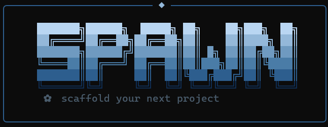

<div align="center">


> Eliminate repetitive project setup. Go from zero to a fully structured dev environment in seconds.

Spawn is a local CLI tool that transforms one command into a complete Python project foundation — directories, Git, dependencies, and a virtual environment set up automatically, so you can start building immediately.

[](https://python.org)
[](https://github.com/Abhiix0/spawn/actions)
[](LICENSE)
[](https://github.com/astral-sh/uv)

</div>

---

## Contents

- [The Problem Spawn Solves](#the-problem-spawn-solves)
- [Features](#features)
- [Prerequisites](#prerequisites)
- [Installation](#installation)
- [Usage](#usage)
- [Project Templates](#project-templates)
  - [1. Backend API](#1-backend-api)
  - [2. CLI Application](#2-cli-application)
  - [3. Automation Tool](#3-automation-tool)
  - [4. AI Chatbot](#4-ai-chatbot)
  - [5. AI Agent](#5-ai-agent)
  - [6. RAG System](#6-rag-system)
  - [7. Data Project](#7-data-project)
- [Bring Your Own Structure](#bring-your-own-structure)
- [Other Commands](#other-commands)
  - [spawn doctor](#spawn-doctor)
  - [spawn version](#spawn-version)
  - [Publish to GitHub](#publish-to-github)
- [Running the Tests](#running-the-tests)
- [Roadmap](#roadmap)
- [Contributing](#contributing)
- [License](#license)

---

## The Problem Spawn Solves

Every new Python project starts with the same manual ritual:

```bash
mkdir my-project && cd my-project
mkdir src tests docs
touch README.md .gitignore
git init
python -m venv .venv && source .venv/bin/activate
...
```

It's repetitive. It's inconsistent. And you haven't written a single line of *real* code yet.

**Spawn collapses all of that into one command: `spawn create`**

---

## Features

| Feature | What it does |
|---|---|
| **Intent-based templates** | Backend API (FastAPI / Flask / Django), CLI Application (Typer / Click / Argparse), Automation Tool, AI Chatbot, AI Agent, RAG System, Data Project (Analysis / Dashboard / ETL / Machine Learning) |
| **Bring your own structure** | Paste any folder layout — Tree, Markdown list, or Indented — and Spawn builds exactly that, no blueprint required |
| **Extras system** | Opt-in ruff, pytest, Docker, GitHub Actions — installed and wired automatically |
| **Dependency installation** | `uv add` runs automatically with the right packages for your choices |
| **Git + uv** | Optionally runs `git init`, `uv init`, and `uv venv` |
| **GitHub publishing** | Connects your project to an existing GitHub repo and pushes the initial commit |
| **spawn doctor** | Scores your project's health out of 100, with per-category breakdowns and a prioritized next step |

---

## Prerequisites

- **Python 3.12+** — [Download here](https://python.org/downloads)
- **uv** — [Install guide](https://github.com/astral-sh/uv)
- **Git** — [Download here](https://git-scm.com/downloads)

> **First time with uv?** Run `pip install uv` or check their [quickstart](https://github.com/astral-sh/uv#getting-started).

---

## Installation

```bash
git clone https://github.com/Abhiix0/spawn.git
cd spawn
uv sync
uv tool install .
```

You can now run `spawn` from anywhere on your machine.

---

## Usage

```bash
spawn create
```

Spawn walks you through a short prompt sequence. The number of steps depends on the template you pick.

**Step 1 — Name your project**

```
Project Name: my-api
```

Spawn rejects names with spaces or special characters, and tells you immediately if that directory already exists.

**Step 2 — Pick a template**

```
  1  Backend API
  2  CLI Application
  3  Automation Tool
  4  AI Chatbot
  5  AI Agent
  6  RAG System
  7  Data Project
  8  Custom Structure

Choose Template [1-8]: 1
```

**Step 3 — Additional prompts** *(template-dependent — framework, provider, project type, and/or extras, depending on what you picked. See [Project Templates](#project-templates) below for each one's exact flow.)*

**Step 4 — Git**

```
Initialize Git? [Y/n]: Y
```

That's it. Spawn generates the project, installs dependencies, and shows you exactly what to run next.

```
╭────── ✨ Project Created Successfully ──────╮
│                                              │
│  Project      my-api                         │
│  Template     Backend API                    │
│  Git          ✓ Enabled                      │
│  UV           ✓ Initialized                  │
│  Virtual Env  ✓ Created                      │
│                                              │
│  Next Steps                                  │
│    cd my-api                                 │
│    uv run uvicorn app.main:app --reload      │
│                                              │
╰──────────────────────────────────────────────╯
```

---

## Project Templates

Every template below follows the same shape: **best for**, **structure**, **prompts you'll see**, **available extras**, and **how to run it**.

### 1. Backend API

Best for: REST APIs, microservices, backend web apps.

```
my-api/
├── app/
│   ├── api/routes/health.py   # GET / → {"status": "running"}
│   ├── core/config.py         # pydantic-settings config
│   ├── models/
│   ├── schemas/
│   ├── services/
│   └── main.py
├── tests/
│   └── test_health.py
├── .env.example
├── README.md
└── .gitignore
```

**Prompts:**

```
  1  fastapi
  2  flask
  3  django

Choose Framework [1-3]: 1

  1  ruff
  2  pytest
  3  docker
  4  github-actions

  Enter numbers separated by commas, or press Enter to skip
Extras []: 1,2
```

**Available extras:** `ruff` `pytest` `docker` `github-actions`

**Run it:**

| Framework | Start command |
|---|---|
| FastAPI | `uv run uvicorn app.main:app --reload` |
| Flask | `uv run python run.py` |
| Django | `uv run python manage.py runserver` |

```bash
cd my-api
uv run uvicorn app.main:app --reload
# GET http://localhost:8000/ → {"status": "running"}
```

---

### 2. CLI Application

Best for: developer tools, automation commands, project generators, setup wizards.

```
my-cli/
├── src/
│   ├── commands/
│   ├── prompts/     # Interactive type only
│   ├── ui/           # Interactive type only
│   ├── utils/
│   └── main.py
├── tests/
├── README.md
└── .gitignore
```

**Prompts:**

```
  1  utility
  2  interactive

Choose CLI Type [1-2]: 1

  1  typer
  2  click
  3  argparse

Choose Framework [1-3]: 1

  1  ruff
  2  pytest
  3  github-actions

  Enter numbers separated by commas, or press Enter to skip
Extras []: 1,2
```

**Available extras:** `ruff` `pytest` `github-actions`

**Run it:**

```bash
cd my-cli
uv run python -m src.main hello       # Utility
uv run python -m src.main greet       # Interactive
```

---

### 3. Automation Tool

Best for: scheduled jobs, data pipelines, reporting systems, integration automation.

```
my-automation/
├── src/
│   ├── workflows/
│   ├── tasks/
│   ├── integrations/
│   ├── utils/
│   └── main.py
├── logs/
├── tests/
├── .env.example
└── README.md
```

**Prompts:**

```
  1  ruff
  2  pytest
  3  github-actions

  Enter numbers separated by commas, or press Enter to skip
Extras []: 1,2
```

**Available extras:** `ruff` `pytest` `github-actions`

**Run it:**

```bash
cd my-automation
uv run python -m src.main
```

---

### 4. AI Chatbot

Best for: customer support bots, study assistants, conversational AI tools.

```
my-chatbot/
├── src/
│   ├── chatbot/
│   ├── providers/
│   ├── prompts/
│   ├── memory/
│   ├── config/
│   └── main.py
├── tests/
├── .env.example
└── README.md
```

**Prompts:**

```
  1  pydantic-ai
  2  openai-sdk
  3  litellm

Choose Framework [1-3]: 1

  1  openai
  2  anthropic
  3  gemini
  4  openrouter
  5  ollama
  6  groq

Choose Provider [1-6]: 1

  1  ruff
  2  pytest
  3  rich
  4  github-actions

  Enter numbers separated by commas, or press Enter to skip
Extras []: 1,2
```

**Available extras:** `ruff` `pytest` `rich` `github-actions`

**Run it:**

```bash
cd my-chatbot
# Add your provider's API key to .env
uv run python -m src.main
```

---

### 5. AI Agent

Best for: task automation, research assistants, tool-calling workflows.

```
my-agent/
├── src/
│   ├── agent/
│   ├── tools/
│   ├── prompts/
│   ├── config/
│   └── main.py
├── tests/
├── .env.example
└── README.md
```

**Prompts:**

```
  1  pydantic-ai
  2  openai-agents

Choose Framework [1-2]: 1

  1  openai
  2  anthropic
  3  gemini
  4  openrouter
  5  ollama
  6  groq

Choose Provider [1-6]: 1

  1  ruff
  2  pytest
  3  github-actions

  Enter numbers separated by commas, or press Enter to skip
Extras []: 1,2
```

> If you pick `openai-agents`, only `openai` and `openrouter` appear as provider choices — the list is filtered per framework.

**Available extras:** `ruff` `pytest` `github-actions`

**Run it:**

```bash
cd my-agent
# Add your provider's API key to .env
uv run python -m src.main
```

Every generated AI Agent project ships with one working tool (a calculator), so you can see tool-calling work immediately — no external services or extra setup beyond your chosen provider's API key.

---

### 6. RAG System

Best for: documentation Q&A, knowledge base search, document retrieval.

```
my-rag/
├── data/
│   └── sample_knowledge.md
├── src/
│   ├── knowledge/
│   ├── ingestion/
│   ├── retrieval/
│   ├── config/
│   └── main.py
├── tests/
├── chroma_db/        # created on first run
├── .env.example
└── README.md
```

**Prompts:**

```
  1  ruff
  2  pytest
  3  github-actions

  Enter numbers separated by commas, or press Enter to skip
Extras []: 1,2
```

RAG System uses a fixed stack — **LlamaIndex + ChromaDB + OpenAI** — so there's no framework or provider prompt, unlike Chatbot and Agent. On first run, it automatically ingests documents from `data/` into a local ChromaDB index, then lets you ask questions against them. Requires an `OPENAI_API_KEY` (used for both the LLM and embeddings).

**Available extras:** `ruff` `pytest` `github-actions`

**Run it:**

```bash
cd my-rag
# Add OPENAI_API_KEY to .env
uv run python -m src.main
# Documents are ingested automatically on first run
```

---

### 7. Data Project

Best for: exploratory data analysis, internal dashboards, data cleaning pipelines, quick ML prototyping.

```
my-data-project/
├── data/
├── notebooks/    # Data Analysis
├── reports/      # Data Analysis
├── dashboard/    # Dashboard
├── pipelines/    # ETL Pipeline
├── models/       # Machine Learning
├── experiments/  # Machine Learning
├── src/
├── tests/
└── .env.example  # ETL Pipeline
```

**Prompts:**

```
  1  Data Analysis
  2  Dashboard
  3  ETL Pipeline
  4  Machine Learning

Choose Project Type [1-4]: 1

  1  ruff
  2  pytest
  3  github-actions

  Enter numbers separated by commas, or press Enter to skip
Extras []: 1,2
```

**Available extras:** `ruff` `pytest` `github-actions`

**Run it:**

| Type | Ships with | Start command |
|---|---|---|
| Data Analysis | Sample CSV + starter notebook (summary stats, saved chart) | `uv run jupyter notebook` |
| Dashboard | Streamlit app with sidebar filter + Plotly chart | `uv run streamlit run dashboard/app.py` |
| ETL Pipeline | Intentionally messy sample CSV + cleaning script (`INPUT_PATH`/`OUTPUT_PATH` via `.env`) | `uv run python -m pipelines.run` |
| Machine Learning | Labeled sample dataset + training script (`RandomForestClassifier`, logs to `experiments/`) | `uv run python src/train.py` |

```bash
# Example — Machine Learning
cd my-data-project
uv run python src/train.py
# Test accuracy: 1.0000
# Model saved to models/model.joblib
# Experiment logged to experiments/20260711_113233.json
```

---

## Bring Your Own Structure

None of the seven templates above fit? **Custom Structure** shows up as the last option in the same `spawn create` picker (`8`) — it's not a separate command, just a different path through the same flow.

Paste any of three text formats — Unix `tree` output, a Markdown list, or plain indented hierarchy — and Spawn parses it, previews the detected folders and files, then creates the structure with the same Git and uv setup as every other template.

```
spawn create
# → Custom Structure
```

```
Paste your project structure.
Supported formats: Tree (├──/└──), Markdown list (- item), Indented hierarchy
Finish with Ctrl+D (Ctrl+Z then Enter on Windows)

app/
├── api/
├── services/
└── tests/
README.md
.gitignore
^Z

Detected
Folders : 4
Files   : 2

Initialize Git? [Y/n]: Y
Initialize uv? [Y/n]: Y
Dependencies (comma separated, optional): fastapi, uvicorn

  Optional Setup
  1  Ruff
  2  Pytest
  3  Pre-commit
  4  Dockerfile

Enter numbers separated by commas, or press Enter to skip: 1,2

Additional ignore patterns (optional, comma separated): data/, *.csv

Proceed? [Y/n]: Y
```

**What Spawn does automatically when it sees these files:**

- `README.md` — generated with your project name, a structure tree, and setup instructions (not left empty)
- `.gitignore` — populated with Python defaults (`.venv/`, `__pycache__/`, `.pytest_cache/`, `.mypy_cache/`, `.ruff_cache/`, etc.) plus any patterns you added, deduplicated

**The Dependencies prompt** (shown only when uv is enabled) installs packages immediately via `uv add`.

**The Optional Setup menu** installs dev tools via `uv add --dev` and generates their config files: `ruff.toml`, `tests/__init__.py`, `.pre-commit-config.yaml`, and/or `Dockerfile`.

---

## Other Commands

### `spawn doctor`

Scores your project's health out of 100 — per-category breakdowns, tiered recommendations, and a single prioritized next step.

```bash
spawn doctor
spawn doctor ./path/to/project
```

```
╭─────────────── 🏥 Project Health Report ─────────────────╮
│                                                           │
│  🟡 Good                                                  │
│  Some improvements recommended.                           │
│                                                           │
│  Project Score: 82%                                       │
│                                                           │
│  Documentation — 67                                       │
│  Version Control — 100                                    │
│  Configuration — 75                                       │
│  Testing — 80                                             │
│  Automation — 50                                          │
│  Code Quality — 100                                       │
│                                                           │
╰───────────────────────────────────────────────────────────╯

╭──────────────────── Recommendations ───────────────────────╮
│                                                            │
│  Critical                                                  │
│    • Initialize a git repository with 'git init'.          │
│                                                            │
│  Recommended                                               │
│    • Add a CHANGELOG.md to document project history.       │
│    • Configure GitHub Actions for CI/CD.                   │
│                                                            │
│  Optional                                                  │
│    • Add a Dockerfile for containerized deployment.        │
│                                                            │
╰────────────────────────────────────────────────────────────╯

╭──────────────────── 🎯 Next Best Step ─────────────────────╮
│                                                             │
│  Initialize a git repository with 'git init'.               │
│  Estimated effort: 30 seconds                               │
│                                                             │
╰─────────────────────────────────────────────────────────────╯
```

Checks span six categories — Documentation, Version Control, Configuration, Testing, Automation, and Code Quality (Ruff, type checking, pre-commit) — all filesystem-based, nothing is executed or sent over the network.

### `spawn version`

```bash
spawn version
# → Spawn v1.0.1
```

### Publish to GitHub

After creation, if Git was enabled, Spawn asks:

```
Publish to GitHub? [y/N]: y
Repository URL: https://github.com/your-username/my-project
```

Spawn stages all files, creates the initial commit, renames the branch to `main`, adds the remote, and pushes.

> The repository must already exist on GitHub. Spawn connects to it — it does not create it.

---

## Running the Tests

```bash
uv run pytest
```

All tests should pass. If they don't, please [open an issue](https://github.com/Abhiix0/spawn/issues).

---

## Roadmap

**Recently shipped**

- Custom Structure workflow — paste any folder layout, Spawn creates it (v1.0.0)
- Doctor 2.0 — per-category health percentages, tiered recommendations, Next Best Step (v1.0.0)
- Data Project intent — analysis, dashboard, ETL, ML sub-options (v0.9.0)
- RAG System intent — LlamaIndex + ChromaDB (v0.8.0)
- AI Agent intent — tool-calling with PydanticAI / OpenAI Agents SDK (v0.7.0)

**What's next**

Nothing formally scheduled yet — Spawn intentionally paused new intents at v1.0 to focus on stability. Ideas under consideration live in [Issues](https://github.com/Abhiix0/spawn/issues); open one if there's something you'd want to see.

For the full version history, see [CHANGELOG.md](docs/changelog.md).

---

## Contributing

Contributions are welcome. Whether it's a bug fix, a new intent, or something from the roadmap — here's how to get started.

### Adding a new intent

**1. Create the intent directory**

```
src/spawn/templates/your_intent/
├── __init__.py    ← subclass BaseTemplate
└── content.py     ← all file content as string constants
```

**2. Register it**

In `src/spawn/core/registry.py`, add a `TemplateMetadata` entry to `TEMPLATES` with your slug, display name, description, template class, and any `available_frameworks` or `available_extras`.

**3. Write tests**

Add coverage in `tests/test_templates.py` and `tests/test_generator.py`. Mock `initialize_uv` and `install_packages` in generator tests.

### Before submitting a PR

```bash
uv run pytest        # must pass
uv run ruff check .  # must be clean
```

---

## License

This project is open source under the [MIT License](LICENSE).

---

<div align="center">

**[Star on GitHub](https://github.com/Abhiix0/spawn)** · **[Report a Bug](https://github.com/Abhiix0/spawn/issues)** · **[Request a Feature](https://github.com/Abhiix0/spawn/issues)**

</div>